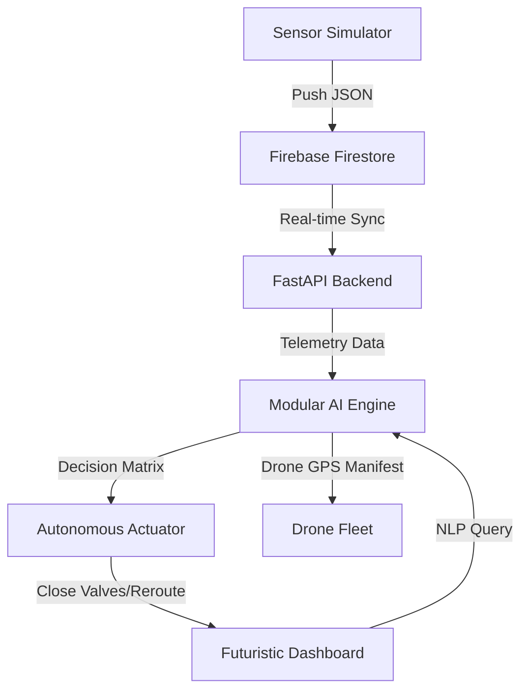

# EcoSentinel AI: The Autonomous Smart City Brain

[](https://devpost.com)
[](https://devpost.com)

**EcoSentinel AI** is a production-grade autonomous system that enables cities to think, adapt, and operate autonomously in real-time. By integrating advanced environmental telemetry with a modular AI reasoning core, it detects anomalies and executes infrastructure actuation protocols (closing valves, rerouting traffic) without human intervention.

## 🚀 Key Features

- **Autonomous Infrastructure Actuation**: Direct control of digital water valves and power grids.
- **Eco-Copilot (City Chatbot)**: NLP interface for engineers to query live city metrics.
- **Geo-Fenced Drone Dispatch**: Automated inspection manifests for critical PM2.5/Turbidity breaches.
- **Predictive Spread Matrix**: Wind-based forecasting to predict the next affected city sector.
- **Dynamic Risk Calculation**: A unified 0-100 score combining air/water/predictive vectors.

## 🛠 Tech Stack

- **Backend**: Python (FastAPI)
- **Database**: Firebase (Firestore - Realtime DB)
- **Frontend**: HTML5, Vanilla JavaScript, CSS3 (Cyberpunk Grid)
- **Visuals**: Chart.js for live telemetry
- **AI Engine**: Modular Gateway (Featherless AI / Antigravity)

## 🏗 Architecture Flow



## ⚙️ Setup & Installation

1. **Environment**: Install dependencies
   ```bash
   pip install -r requirements.txt
   ```
2. **Configuration**:
   - Create a `.env` file with `FEATHERLESS_API_KEY`.
   - Add `serviceAccountKey.json` for Firebase (Optional: Local Demo mode included).
3. **Launch**:
   - Terminal 1: `python sensor_simulator.py`
   - Terminal 2: `uvicorn app:app --reload`
   - Terminal 3: Open `index.html` in your browser.

---

**Built by Aravinth S, AI Engineer at Shree Venkateswara Hi-Tech Engineering College. Special thanks to mentors Prakshal Doshi & Praneetha Kotla.**
